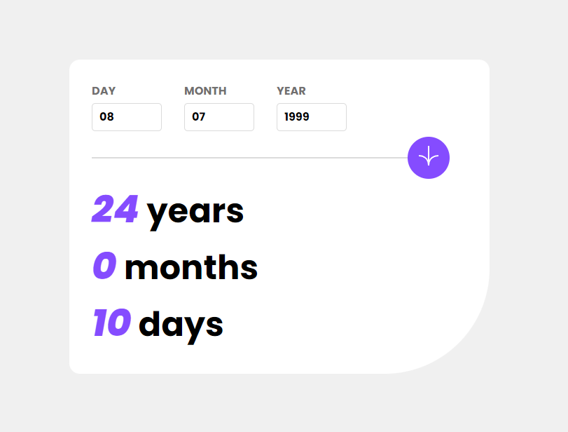

# Frontend Mentor - Intro section with dropdown navigation

This is a solution to the [Age Calculator App](https://www.frontendmentor.io/challenges/age-calculator-app-dF9DFFpj-Q). Frontend Mentor challenges help me improve my coding skills by building realistic projects.

## 🔗 Links

- Solution URL: [Click here](https://github.com/WallaceMartinsTI/FM_intro_section_with_dropdown_navigation)
- Live Site URL: [Click here](https://github.com/WallaceMartinsTI/FM_age_calculator_app)

## 🛠️ Built with

- Semantic HTML5 markup
- CSS Media Queries
- Flexbox
- DOM Manipulation
- Javascript

## 👨‍💻 Author

- Github - [WallaceMartinsTI](https://github.com/WallaceMartinsTI)
- Frontend Mentor - [@WallaceMartinsTI](https://www.frontendmentor.io/profile/WallaceMartinsTI)
- Twitter - [@Wallacexp159](https://twitter.com/wallacexp159)

## 📄 License

This project is under the MIT license. See the [LICENSE](LICENSE) file for more details.
 
